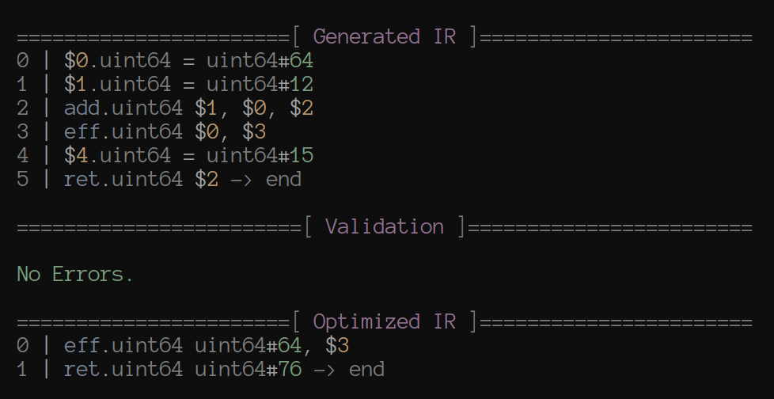

# AnneC compiler

C superset. Custom backend.

## File structure

* `include/` - header files.
  * `acir/` - annec ir.
    * `acir.h` - main header.
  * `annec_anchor.h` - core library. (streams, allocators, ...)
* `src/` - source files.
  * `acir/` - annec ir.
    * `cli.h` - private header with utility declarations and defines.
    * `core.c` - annec ir most function definitions.
    * `optimizer.c` - annec ir optimizer related functrions.
    * `test.c` - test file with an entry point.
  * `annec/` - annec compiler.
  * `anchor.c` - annec-anchor function definitions.

## Building

No build system right now, just `clang src/**/*.c -o test -std=c17 -Iinclude`.
